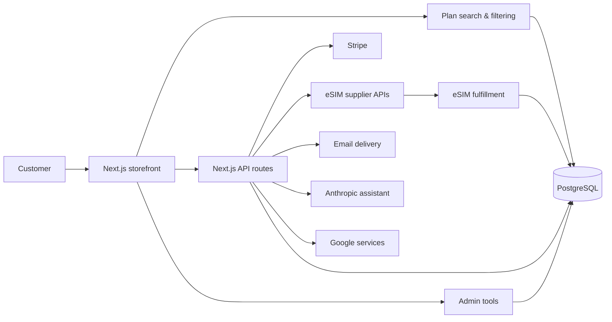

# eSIMBeast

**A full-stack eSIM marketplace built for real customers to discover, purchase, and manage international mobile data plans.**

eSIMBeast combines plan discovery, payment processing, supplier integrations, automated fulfillment, order tracking, email delivery, and administrative tooling into a single customer-facing product.

**Live product:** [esimbeast.com](https://www.esimbeast.com)

> This repository represents the version I developed and delivered. The production application has continued evolving with client-side changes, so the live code may differ from this portfolio snapshot.

## Project highlights

* **International eSIM discovery** — search and filter plans by destination, data allowance, duration, and other plan characteristics.
* **Multi-supplier integration** — communicate with external eSIM providers through supplier-specific APIs.
* **End-to-end checkout** — process customer payments through Stripe and connect successful transactions to fulfillment.
* **Automated eSIM delivery** — order plans from suppliers and persist activation details, QR links, and order state.
* **Persistent order management** — track products, customers, payments, supplier information, and fulfillment state in PostgreSQL.
* **Customer status tools** — allow customers to inspect plan and order status after purchase.
* **Administrative workflows** — support internal management of plans and store data.
* **Supporting integrations** — transactional email, Google services, referral tracking, SEO tooling, and AI-powered customer assistance.

## Product flow

1. A customer searches for plans based on their destination and travel requirements.
2. Matching plans are retrieved from the application database and presented through the storefront.
3. The customer selects a plan and completes payment through Stripe.
4. The backend places the corresponding order with the appropriate eSIM supplier.
5. Fulfillment information such as QR codes and activation details is stored with the order.
6. The customer can retrieve their purchase and plan status through the application.

## Technical architecture



The application combines the customer storefront and backend API layer in a single Next.js project. Prisma provides the persistence layer for plans and orders, while API routes coordinate payments, supplier ordering, email delivery, plan-status checks, and external integrations.

The purchase workflow persists order state before and after payment, connects successful transactions to the relevant supplier, stores fulfillment information such as activation data and QR links, and exposes that state back to the customer-facing application.

## Technology stack

| Area              | Technologies                       |
| ----------------- | ---------------------------------- |
| Front end         | Next.js, React                     |
| Backend           | Next.js API Routes, Node.js        |
| Database          | PostgreSQL, Prisma ORM             |
| Payments          | Stripe                             |
| eSIM integrations | eSIMAccess, WorldMove              |
| Email             | Nodemailer                         |
| AI                | Anthropic API                      |
| External services | Google APIs, Google Sheets         |
| Styling           | CSS Modules, Tailwind CSS, Emotion |

## Running locally

### Prerequisites

* Node.js and npm
* PostgreSQL
* Credentials for any external services you want to exercise locally

### Setup

```bash
git clone https://github.com/nofechbo/esimbeast.git
cd esimbeast/website

npm install
cp .env.example .env.local
npx prisma generate
npm run dev
```

Open http://localhost:3000.

The application relies on external services for features such as payments, supplier fulfillment, email, database access, Google services, and AI functionality.

See `.env.example` for the expected environment variables.

## Available commands

Run these from `website/`.

| Command                | Purpose                              |
| ---------------------- | ------------------------------------ |
| `npm run dev`          | Start the Next.js development server |
| `npm run build`        | Create a production build            |
| `npm start`            | Serve the production build           |
| `npm run export:plans` | Export plan data to CSV              |

## Repository structure

```text
esimbeast/
├── README.md
└── website/
    ├── components/     # Reusable UI components
    ├── lib/            # Shared application and integration logic
    ├── pages/
    │   ├── api/        # Backend API routes
    │   ├── admin/      # Administration UI
    │   ├── payment/    # Checkout flow
    │   └── plans/      # Plan browsing
    ├── prisma/         # Database schema and migrations
    ├── scripts/        # Data and maintenance utilities
    └── public/         # Static assets
```

## Engineering decisions demonstrated

* **Unified product and API layer:** Next.js hosts both the customer experience and server-side application endpoints.
* **Supplier abstraction:** fulfillment logic supports multiple external eSIM providers rather than coupling the product to one vendor.
* **Persistent order state:** purchase and fulfillment state is stored independently of temporary browser sessions or supplier responses.
* **Payment-to-fulfillment workflow:** successful payments transition into external ordering and delivery rather than ending at checkout.
* **External-service integration:** payments, suppliers, email, Google services, and AI functionality are coordinated within one application.
* **Real product constraints:** the system was developed for an actual client and deployed for real users rather than solely as a demonstration application.

## Portfolio context

This project was built for an actual client and deployed as a customer-facing product.

It gave me practical experience connecting frontend UX, backend APIs, payments, external suppliers, persistent data, and automated fulfillment into one production-oriented system.
